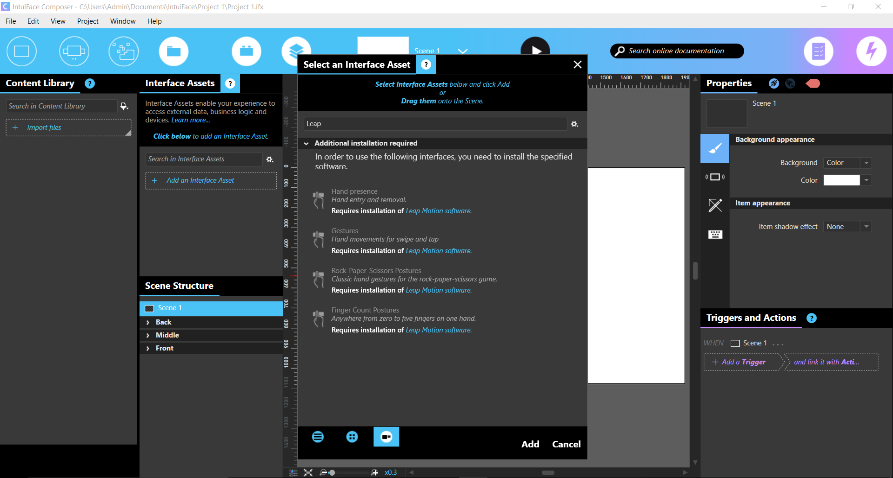

# Leap Motion Interface Assets for IntuiFace

This project contains Leap Motion Interface Assets for IntuiFace Player & IntuiFace Composer.

The [Leap Motion](http://www.leapmotion.com/) Interface Assets enable you to control an IntuiFace experience using the Leap Motion Controller. 
IntuiFace provides a set of gestures and postures to trigger any action in your experience.

There are four available Leap Motion Interface Assets, accessible in the Select an interface panel:
* **Hand presence**: detects hand entry and removal
* **Gestures**: detects hand movements for swipe left/right and tap down
* **Rock-Paper-Scissors Postures**: detects the classic hand postures for the rock-paper-scissors game
* **Finger Count Postures**: detects the number of fingers from one to five on one hand

See more information on our support webpage: [Using Leap Motion in IntuiFace Composer](http://support.intuilab.com/kb/non-touch-interactive-devices/using-leap-motion).

# How to compile this project?

**PREREQUISITES**: you must have Visual Studio 2013 and .NET 4.5.1 installed.

The code for Leap Motion Interface Assets is C#.

To compile this project, follow these steps:
* Open **IntuiLab.Leap.sln** in Visual Studio 2013,
* Build the solution in **Release** mode,
* Navigate to the root of the project, you can see a folder called **"LeapIA"** which contains all Leap Motion Interface Assets.

# How to use Leap Motion Interface Assets?

To be able to add Leap Motion Interface Assets in IntuiFace Composer, follow these steps: 
* Copy **"LeapIA"** folder to the path "[Drive]:\Users\[UserName]\Documents\IntuiFace\Interface Assets"
* Launch **IntuiFace Composer**
* Add an Interface Asset and when you enter "Leap" in the search bar, you can see all **Leap Motion Interface Assets**

See more information on our support webpage: [Using Leap Motion in IntuiFace Composer](http://support.intuilab.com/kb/non-touch-interactive-devices/using-leap-motion).

